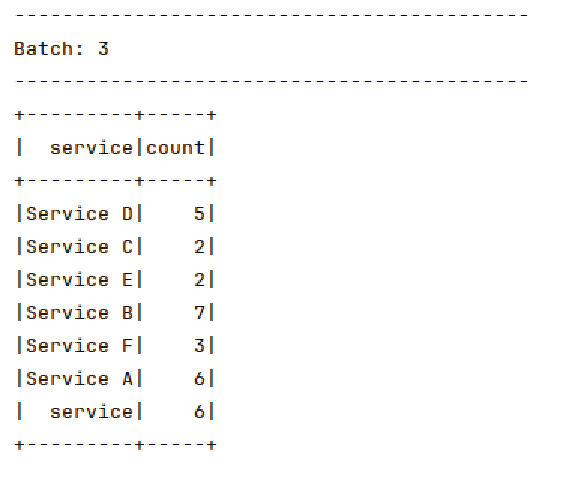

#  Spark Structured Streaming
Structured Streaming is a scalable and fault-tolerant stream processing engine built on the Spark SQL engine. It allows you to express streaming computations the same way you would express batch computations on static data.

We want to develop a Spark application for the hospital that receives hospital incidents in streaming with Structured Streaming. The incidents are received in streaming in csv files (see file attachment).

The data format in the csv files and the following:

Id, title, description, service, date 

## Dependencies

```

<dependencies>
    <dependency>
        <groupId>org.apache.spark</groupId>
        <artifactId>spark-core_2.13</artifactId>
        <version>3.4.1</version>
    </dependency>
    <!-- https://mvnrepository.com/artifact/org.apache.spark/spark-streaming -->
    <dependency>
        <groupId>org.apache.spark</groupId>
        <artifactId>spark-streaming_2.13</artifactId>
        <version>3.4.1</version>

    </dependency>
    <dependency>
        <groupId>org.apache.spark</groupId>
        <artifactId>spark-sql_2.13</artifactId>
        <version>3.4.1</version>
    </dependency>

    <dependency>
        <groupId>org.slf4j</groupId>
        <artifactId>slf4j-api</artifactId>
        <version>1.7.32</version>
    </dependency>
    <dependency>
        <groupId>org.slf4j</groupId>
        <artifactId>slf4j-log4j12</artifactId>
        <version>1.7.32</version>
    </dependency>
</dependencies>

```

## CSV file 

### File 1
```
Id,titre,description,service,date
1,Incident 1,Description de l'incident 1,Service A,2023-01-15
2,Incident 2,Description de l'incident 2,Service B,2023-02-20
3,Incident 3,Description de l'incident 3,Service A,2023-03-10
4,Incident 4,Description de l'incident 4,Service C,2023-04-05
5,Incident 5,Description de l'incident 5,Service B,2023-04-15
6,Incident 6,Description de l'incident 6,Service D,2022-05-01
7,Incident 7,Description de l'incident 7,Service D,2022-05-01
```

### File 2
```
Id,titre,description,service,date
1,Incident 1,Description de l'incident 1,Service A,2023-01-15
2,Incident 2,Description de l'incident 2,Service B,2023-02-20
3,Incident 3,Description de l'incident 3,Service A,2023-03-10
4,Incident 4,Description de l'incident 4,Service C,2023-04-05
5,Incident 5,Description de l'incident 5,Service B,2023-04-15
6,Incident 6,Description de l'incident 6,Service A,2023-05-01
7,Incident 7,Description de l'incident 7,Service A,2022-05-01
8,Incident 8,Description de l'incident 8,Service D,2022-05-01
9,Incident 9,Description de l'incident 9,Service B,2022-05-01
```

### File 3
```
Id,titre,description,service,date
1,Incident 1,Description de l'incident 1,Service D,2023-01-15
2,Incident 2,Description de l'incident 2,Service D,2023-02-20
```

### File 4
```
Id,titre,description,service,date
1,Incident 1,Description de l'incident 1,Service E,2023-01-15
2,Incident 2,Description de l'incident 2,Service E,2023-02-20
```

### File 5
```
Id,titre,description,service,date
1,Incident 1,Description de l'incident 1,Service B,2022-01-15
2,Incident 2,Description de l'incident 2,Service B,2022-02-20
```
### File 6
```
Id,titre,description,service,date
1,Incident 1,Description de l'incident 1,Service F,2022-01-15
2,Incident 2,Description de l'incident 2,Service F,2022-02-20
3,Incident 3,Description de l'incident 3,Service F,2022-02-20
```


## Incidents class 
This Java program represents a Spark Streaming application designed to continuously analyze data related to hospital incidents. It starts by initializing a Spark session, defining a schema for the data, and then reads this data continuously from a specified CSV directory. Two aggregation tasks are then defined. The first task continuously displays the number of incidents grouped by service, with a display interval of one minute. The second task identifies and displays the two years with the highest number of incidents, updating the results every 10 seconds. The results of these analyses are shown in the console, and the program waits for the completion of streaming for each task. Overall, the code provides an example of continuous processing of data streams with Spark, enabling dynamic monitoring of hospital incidents based on different criteria.

```
public static void main(String[] args) throws TimeoutException, StreamingQueryException {
        // Initialiser SparkSession
        SparkSession sparkS = SparkSession.builder()
                .appName("HospitalIncidentStreaming")
                .master("local[*]")
                .getOrCreate();

        // Définir le schéma des données
        StructType schema = new StructType()
                .add("Id", StringType, true)
                .add("titre", StringType, true)
                .add("description", StringType, true)
                .add("service", StringType, true)
                .add("date", StringType, true);

        // Lire les données en streaming
        Dataset<Row> streamingData = sparkS
                .readStream()
                .schema(schema)
                .csv("incidents");

        // Tâche 1 : Afficher le nombre d'incidents par service de manière continue
        StreamingQuery query1 = streamingData.groupBy("service")
                .count()
                .writeStream()
                .outputMode("complete")
                .format("console")
                .trigger(Trigger.ProcessingTime("1 minute"))
                .start();

        // Tâche 2 : Afficher les deux années avec le plus grand nombre d'incidents de manière continue
        StreamingQuery query2 = streamingData.groupBy(functions.year(functions.to_date(streamingData.col("date"))).alias("year"))
                .count()
                .orderBy(functions.desc("count"))
                .limit(2)
                .writeStream()
                .outputMode("complete")
                .format("console")
                .trigger(Trigger.ProcessingTime("10 seconds"))
                .start();

        // Attendre la fin du streaming
        query1.awaitTermination();
        query2.awaitTermination();


    }

```

## Execution

First i created 3 csv file 


Second i created another 1 file


Third i added another 1 file 


Fourth i added another 1 file




